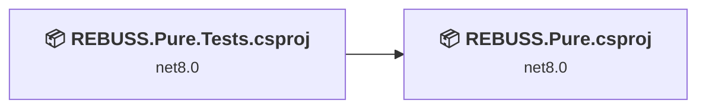
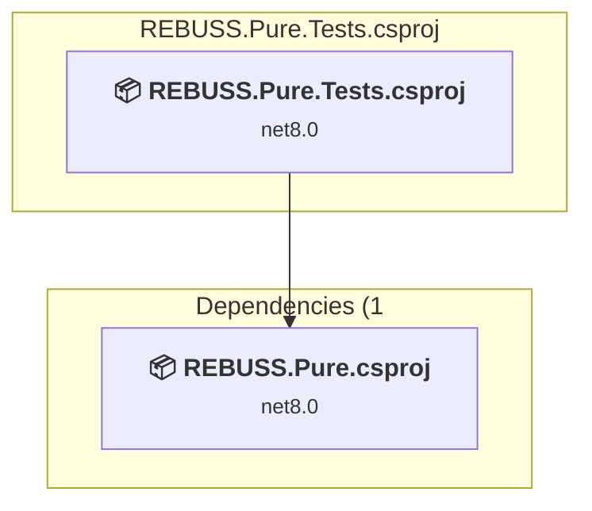
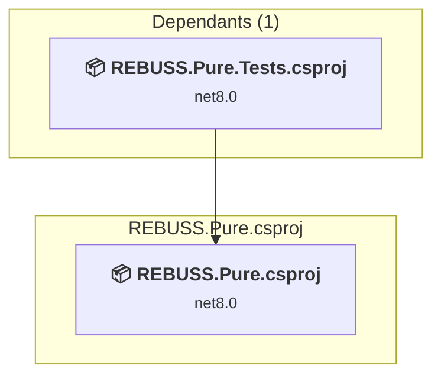

# Projects and dependencies analysis

This document provides a comprehensive overview of the projects and their dependencies in the context of upgrading to .NETCoreApp,Version=v10.0.

## Table of Contents

- [Executive Summary](#executive-Summary)
  - [Highlevel Metrics](#highlevel-metrics)
  - [Projects Compatibility](#projects-compatibility)
  - [Package Compatibility](#package-compatibility)
  - [API Compatibility](#api-compatibility)
- [Aggregate NuGet packages details](#aggregate-nuget-packages-details)
- [Top API Migration Challenges](#top-api-migration-challenges)
  - [Technologies and Features](#technologies-and-features)
  - [Most Frequent API Issues](#most-frequent-api-issues)
- [Projects Relationship Graph](#projects-relationship-graph)
- [Project Details](#project-details)

  - [REBUSS.Pure.Tests\REBUSS.Pure.Tests.csproj](#rebusspuretestsrebusspuretestscsproj)
  - [REBUSS.Pure\REBUSS.Pure.csproj](#rebusspurerebusspurecsproj)

## Executive Summary

### Highlevel Metrics

| Metric | Count | Status |
| :--- | :---: | :--- |
| Total Projects | 2 | All require upgrade |
| Total NuGet Packages | 16 | 11 need upgrade |
| Total Code Files | 131 |  |
| Total Code Files with Incidents | 23 |  |
| Total Lines of Code | 14331 |  |
| Total Number of Issues | 127 |  |
| Estimated LOC to modify | 114+ | at least 0,8% of codebase |

### Projects Compatibility

| Project | Target Framework | Difficulty | Package Issues | API Issues | Est. LOC Impact | Description |
| :--- | :---: | :---: | :---: | :---: | :---: | :--- |
| [REBUSS.Pure.Tests\REBUSS.Pure.Tests.csproj](#rebusspuretestsrebusspuretestscsproj) | net8.0 | 🟢 Low | 1 | 68 | 68+ | DotNetCoreApp, Sdk Style = True |
| [REBUSS.Pure\REBUSS.Pure.csproj](#rebusspurerebusspurecsproj) | net8.0 | 🟢 Low | 10 | 46 | 46+ | DotNetCoreApp, Sdk Style = True |

### Package Compatibility

| Status | Count | Percentage |
| :--- | :---: | :---: |
| ✅ Compatible | 5 | 31,3% |
| ⚠️ Incompatible | 2 | 12,5% |
| 🔄 Upgrade Recommended | 9 | 56,3% |
| ***Total NuGet Packages*** | ***16*** | ***100%*** |

### API Compatibility

| Category | Count | Impact |
| :--- | :---: | :--- |
| 🔴 Binary Incompatible | 1 | High - Require code changes |
| 🟡 Source Incompatible | 1 | Medium - Needs re-compilation and potential conflicting API error fixing |
| 🔵 Behavioral change | 112 | Low - Behavioral changes that may require testing at runtime |
| ✅ Compatible | 17681 |  |
| ***Total APIs Analyzed*** | ***17795*** |  |

## Aggregate NuGet packages details

| Package | Current Version | Suggested Version | Projects | Description |
| :--- | :---: | :---: | :--- | :--- |
| Azure.Identity | 1.13.2 |  | [REBUSS.Pure.csproj](#rebusspurerebusspurecsproj) | ⚠️NuGet package is deprecated |
| coverlet.collector | 6.0.4 |  | [REBUSS.Pure.Tests.csproj](#rebusspuretestsrebusspuretestscsproj) | ✅Compatible |
| Microsoft.Extensions.Configuration | 9.0.0 | 10.0.5 | [REBUSS.Pure.csproj](#rebusspurerebusspurecsproj) | NuGet package upgrade is recommended |
| Microsoft.Extensions.Configuration.EnvironmentVariables | 9.0.0 | 10.0.5 | [REBUSS.Pure.csproj](#rebusspurerebusspurecsproj) | NuGet package upgrade is recommended |
| Microsoft.Extensions.Configuration.Json | 9.0.0 | 10.0.5 | [REBUSS.Pure.csproj](#rebusspurerebusspurecsproj) | NuGet package upgrade is recommended |
| Microsoft.Extensions.DependencyInjection | 9.0.0 | 10.0.5 | [REBUSS.Pure.csproj](#rebusspurerebusspurecsproj) | NuGet package upgrade is recommended |
| Microsoft.Extensions.Http | 9.0.0 | 10.0.5 | [REBUSS.Pure.csproj](#rebusspurerebusspurecsproj) | NuGet package upgrade is recommended |
| Microsoft.Extensions.Http.Resilience | 10.4.0 |  | [REBUSS.Pure.csproj](#rebusspurerebusspurecsproj) | ✅Compatible |
| Microsoft.Extensions.Logging | 9.0.0 | 10.0.5 | [REBUSS.Pure.csproj](#rebusspurerebusspurecsproj) | NuGet package upgrade is recommended |
| Microsoft.Extensions.Logging.Console | 9.0.0 | 10.0.5 | [REBUSS.Pure.csproj](#rebusspurerebusspurecsproj) | NuGet package upgrade is recommended |
| Microsoft.Extensions.Options.ConfigurationExtensions | 9.0.0 | 10.0.5 | [REBUSS.Pure.csproj](#rebusspurerebusspurecsproj) | NuGet package upgrade is recommended |
| Microsoft.NET.Test.Sdk | 17.14.1 |  | [REBUSS.Pure.Tests.csproj](#rebusspuretestsrebusspuretestscsproj) | ✅Compatible |
| NSubstitute | 5.3.0 |  | [REBUSS.Pure.Tests.csproj](#rebusspuretestsrebusspuretestscsproj) | ✅Compatible |
| System.Text.Json | 9.0.0 | 10.0.5 | [REBUSS.Pure.csproj](#rebusspurerebusspurecsproj) | NuGet package upgrade is recommended |
| xunit | 2.9.3 |  | [REBUSS.Pure.Tests.csproj](#rebusspuretestsrebusspuretestscsproj) | ⚠️NuGet package is deprecated |
| xunit.runner.visualstudio | 3.1.4 |  | [REBUSS.Pure.Tests.csproj](#rebusspuretestsrebusspuretestscsproj) | ✅Compatible |

## Top API Migration Challenges

### Technologies and Features

| Technology | Issues | Percentage | Migration Path |
| :--- | :---: | :---: | :--- |

### Most Frequent API Issues

| API | Count | Percentage | Category |
| :--- | :---: | :---: | :--- |
| T:System.Text.Json.JsonDocument | 55 | 48,2% | Behavioral Change |
| T:System.Uri | 28 | 24,6% | Behavioral Change |
| T:System.Net.Http.HttpContent | 17 | 14,9% | Behavioral Change |
| M:System.Uri.#ctor(System.String) | 6 | 5,3% | Behavioral Change |
| P:System.Uri.AbsoluteUri | 3 | 2,6% | Behavioral Change |
| M:System.Uri.#ctor(System.Uri,System.String) | 1 | 0,9% | Behavioral Change |
| M:System.TimeSpan.FromSeconds(System.Double) | 1 | 0,9% | Source Incompatible |
| M:System.Uri.TryCreate(System.String,System.UriKind,System.Uri@) | 1 | 0,9% | Behavioral Change |
| M:Microsoft.Extensions.DependencyInjection.OptionsConfigurationServiceCollectionExtensions.Configure''1(Microsoft.Extensions.DependencyInjection.IServiceCollection,Microsoft.Extensions.Configuration.IConfiguration) | 1 | 0,9% | Binary Incompatible |
| M:Microsoft.Extensions.Logging.ConsoleLoggerExtensions.AddConsole(Microsoft.Extensions.Logging.ILoggingBuilder,System.Action{Microsoft.Extensions.Logging.Console.ConsoleLoggerOptions}) | 1 | 0,9% | Behavioral Change |

## Projects Relationship Graph

Legend:
📦 SDK-style project
⚙️ Classic project

## Project Details

### REBUSS.Pure.Tests\REBUSS.Pure.Tests.csproj

#### Project Info

- **Current Target Framework:** net8.0
- **Proposed Target Framework:** net10.0
- **SDK-style**: True
- **Project Kind:** DotNetCoreApp
- **Dependencies**: 1
- **Dependants**: 0
- **Number of Files**: 34
- **Number of Files with Incidents**: 11
- **Lines of Code**: 6970
- **Estimated LOC to modify**: 68+ (at least 1,0% of the project)

#### Dependency Graph

Legend:
📦 SDK-style project
⚙️ Classic project

### API Compatibility

| Category | Count | Impact |
| :--- | :---: | :--- |
| 🔴 Binary Incompatible | 0 | High - Require code changes |
| 🟡 Source Incompatible | 0 | Medium - Needs re-compilation and potential conflicting API error fixing |
| 🔵 Behavioral change | 68 | Low - Behavioral changes that may require testing at runtime |
| ✅ Compatible | 10122 |  |
| ***Total APIs Analyzed*** | ***10190*** |  |

### REBUSS.Pure\REBUSS.Pure.csproj

#### Project Info

- **Current Target Framework:** net8.0
- **Proposed Target Framework:** net10.0
- **SDK-style**: True
- **Project Kind:** DotNetCoreApp
- **Dependencies**: 0
- **Dependants**: 1
- **Number of Files**: 101
- **Number of Files with Incidents**: 12
- **Lines of Code**: 7361
- **Estimated LOC to modify**: 46+ (at least 0,6% of the project)

#### Dependency Graph

Legend:
📦 SDK-style project
⚙️ Classic project

### API Compatibility

| Category | Count | Impact |
| :--- | :---: | :--- |
| 🔴 Binary Incompatible | 1 | High - Require code changes |
| 🟡 Source Incompatible | 1 | Medium - Needs re-compilation and potential conflicting API error fixing |
| 🔵 Behavioral change | 44 | Low - Behavioral changes that may require testing at runtime |
| ✅ Compatible | 7559 |  |
| ***Total APIs Analyzed*** | ***7605*** |  |

